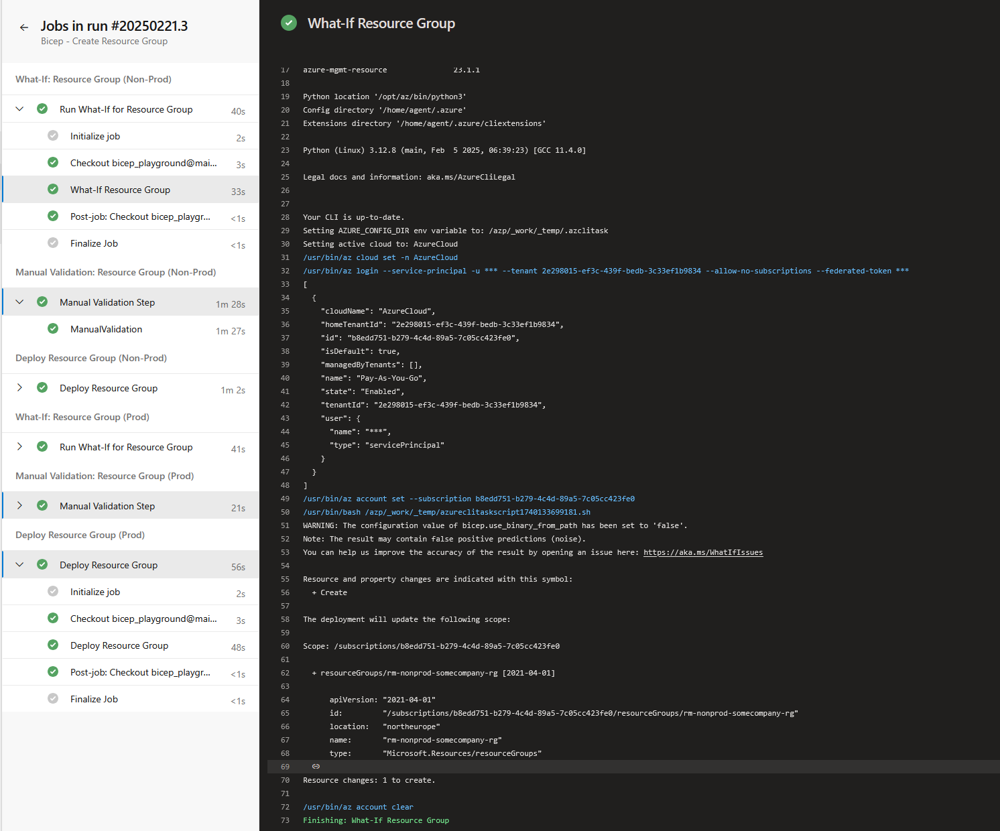
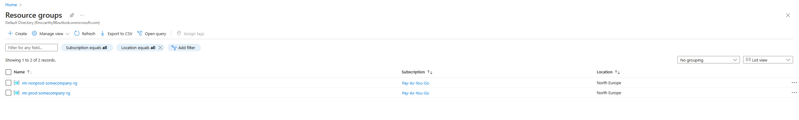
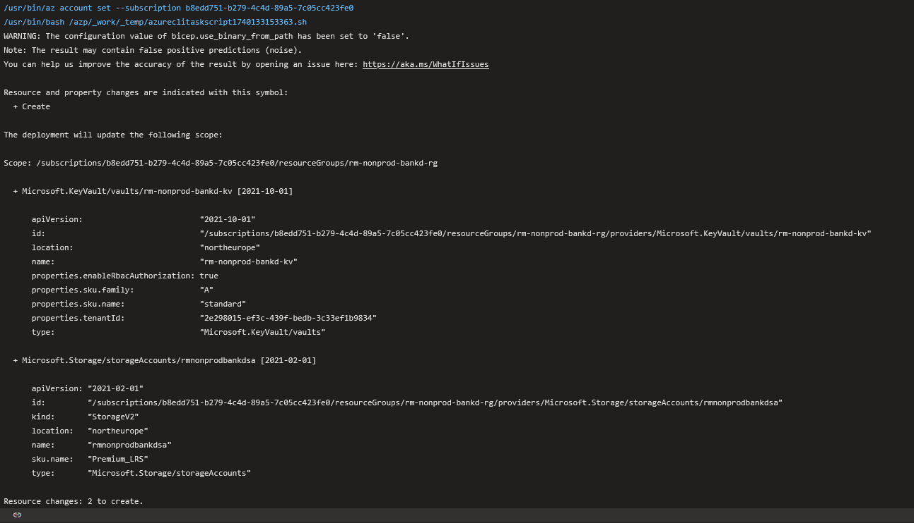
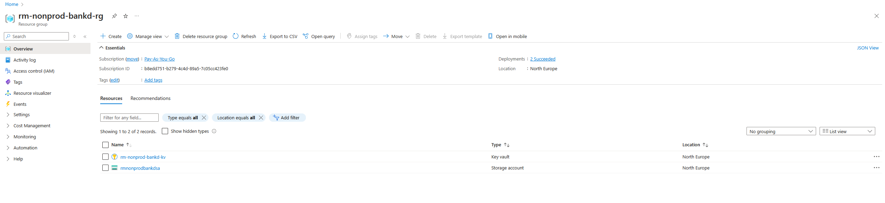

# Bicep Playground

This repo is designed for experimenting with **Bicep modules, module parameters**, and overall best practices for Infrastructure as Code (IaC) using **Bicep** in Azure.

## Features
-  **Experiment with Bicep modules**
-  **Test various module parameters and configurations**
-  **Validate deployment best practices**

## Pipelines Workflow:
# There are two seperate Pipelines. Once creates the RG's passing paramaters from the bicep module call. The other pipeline creates the resources, this pipeline requires you to enter the RG name. More info about this in tech debt section
# RG What-If Pipeline

# RG deployment based on product name and env params

Resources What-If Pipeline Run

Resources Deployed in Azure

## Tech Debt / if I had more time

- **Pass RG name as an output and then pass this to resource deployment stage so no manual names are needed**
- **Enable SFTP on the SA (This was due to cost)**
- **Allow SSH keys to be pulled from a KV that then setsup the SSH permission**